# **Ubuntu_Server**
## Instalación 
### 1.Configuración M.V
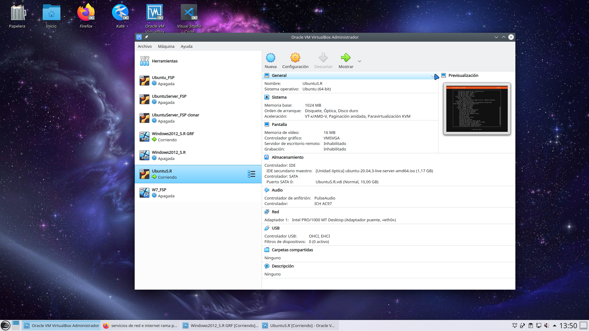
### 2.Configuramos el Ubuntu Server
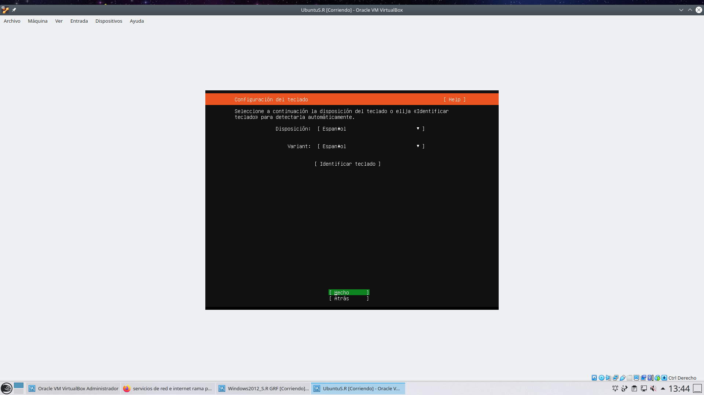
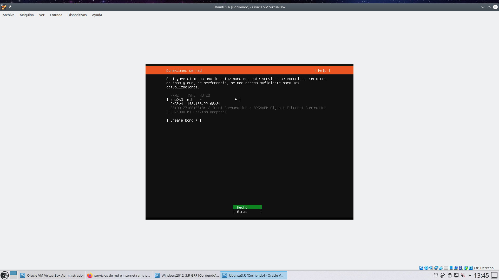
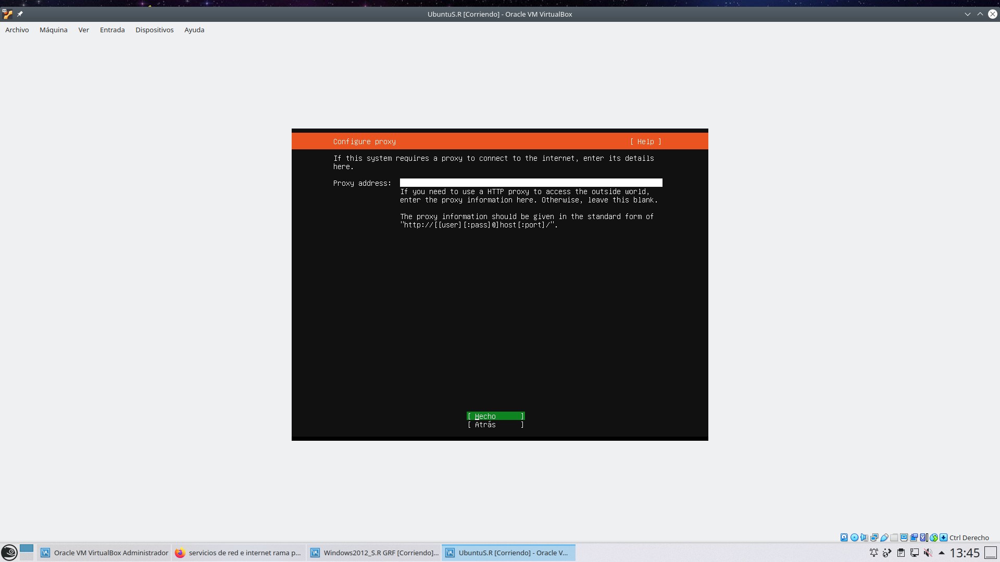
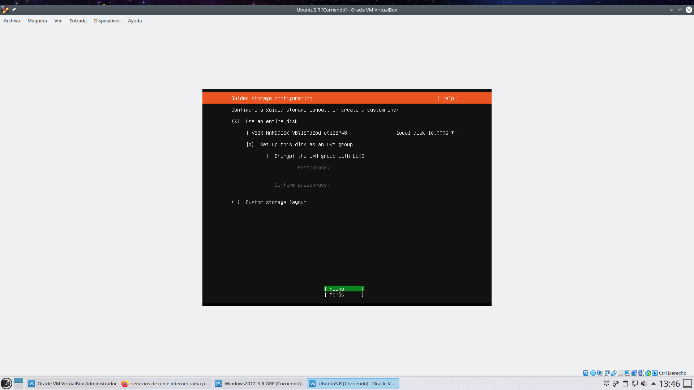
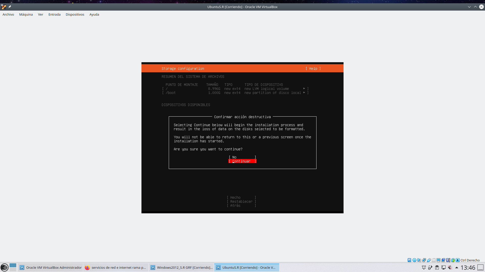
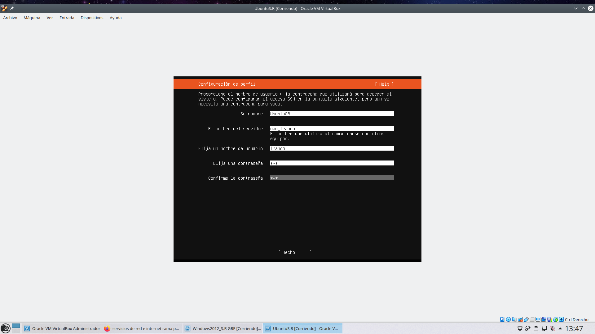
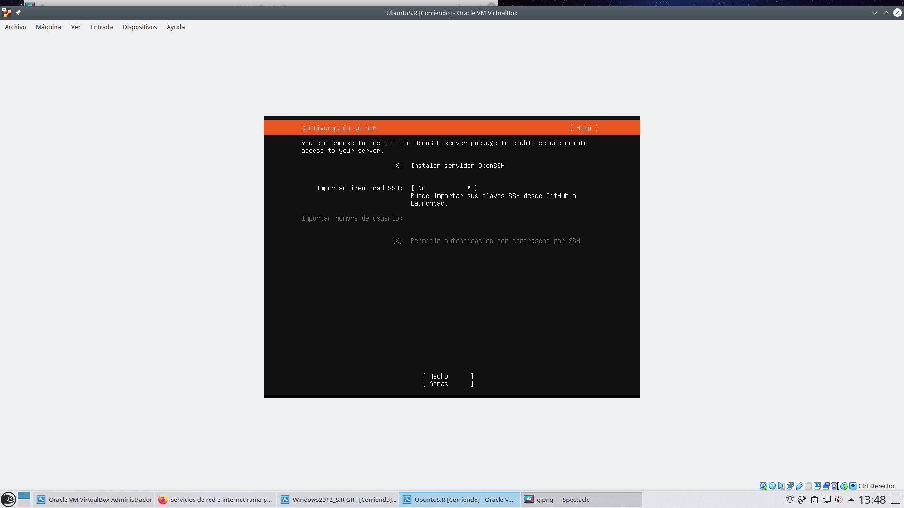
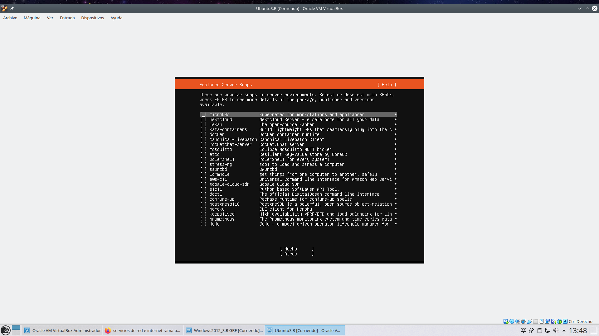
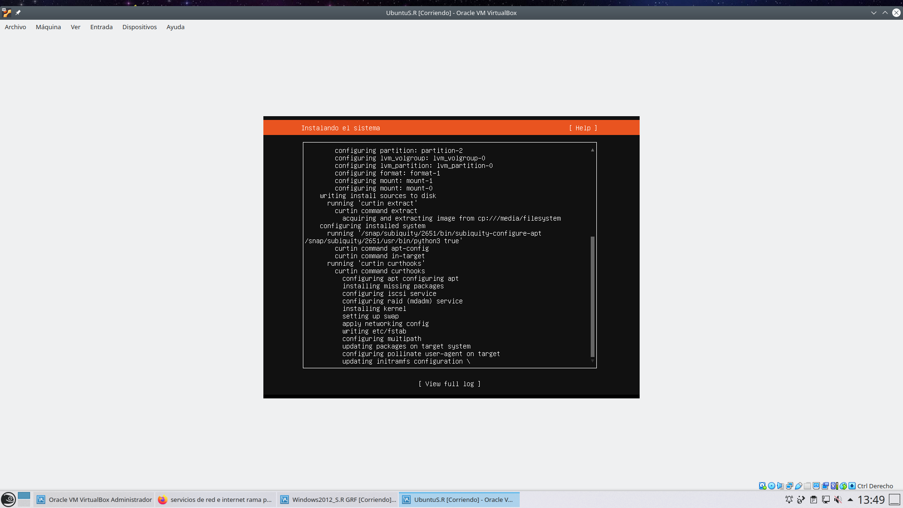
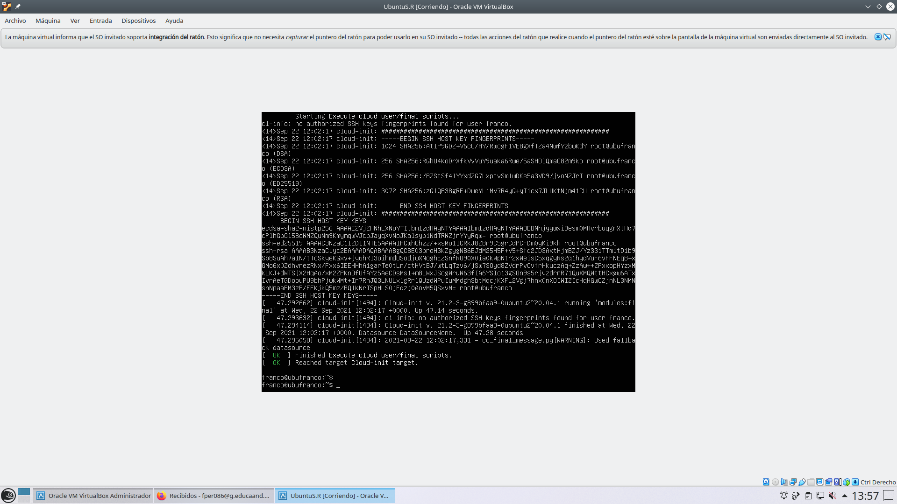
### 3.Configuramos el internet LAN 
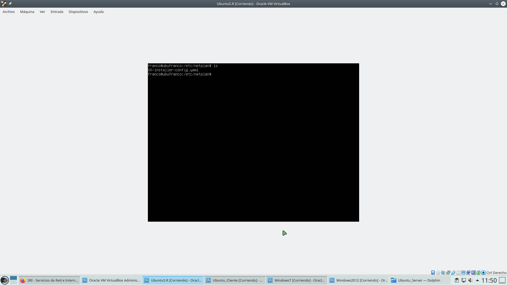
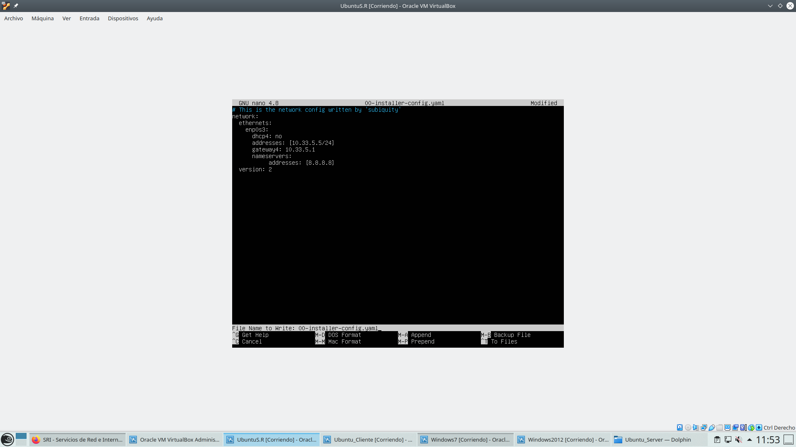
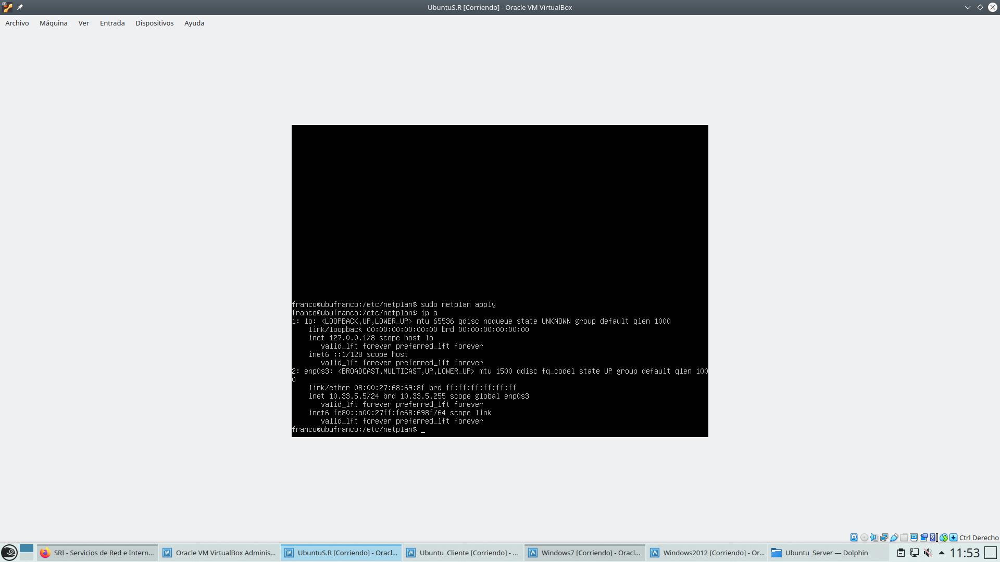
### 4.Modificamos el archivo /etc/resolv.conf, /etc/hosts y /etc/hostname 
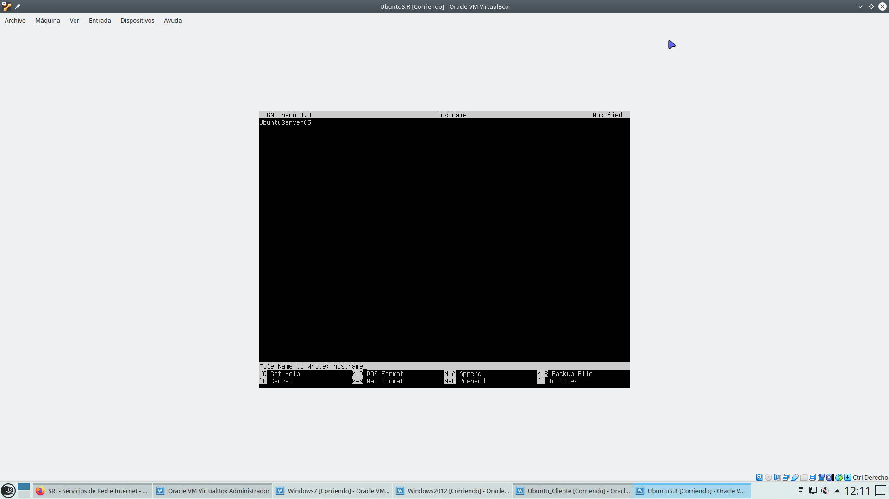
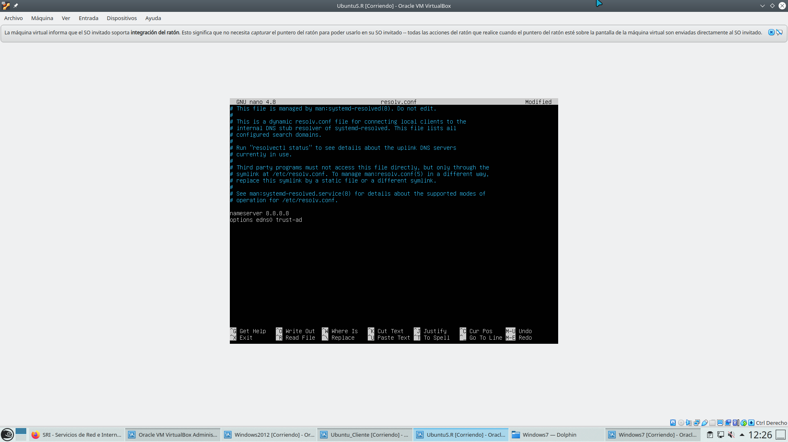
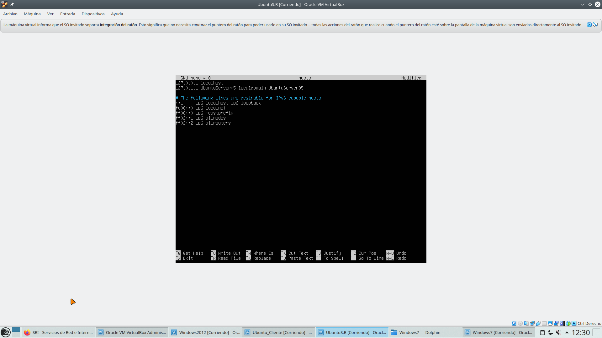
