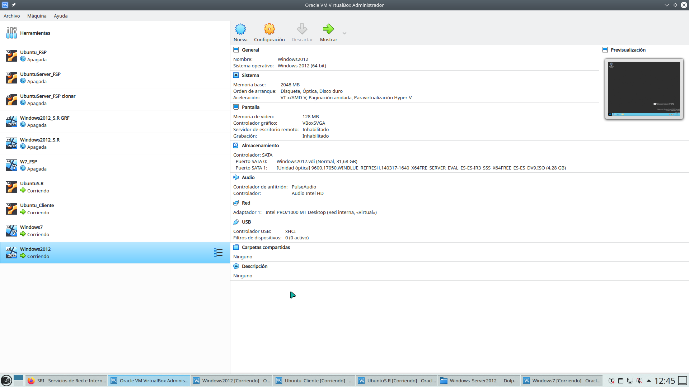
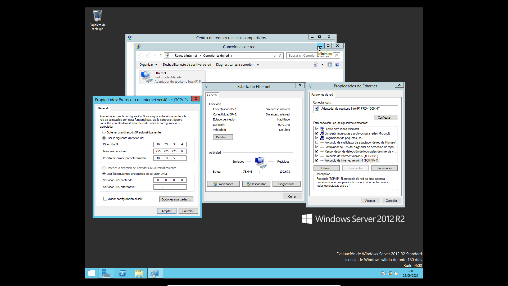
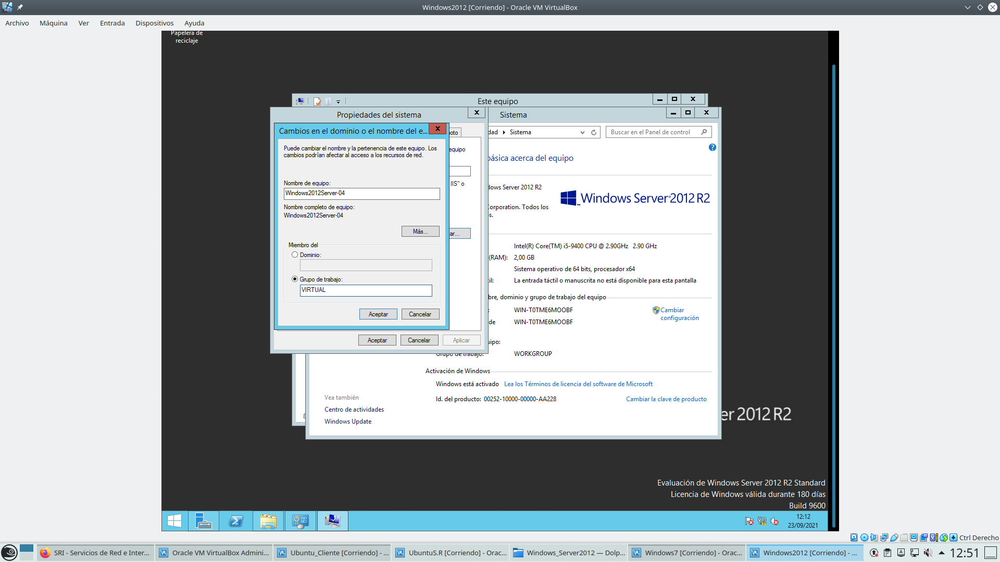
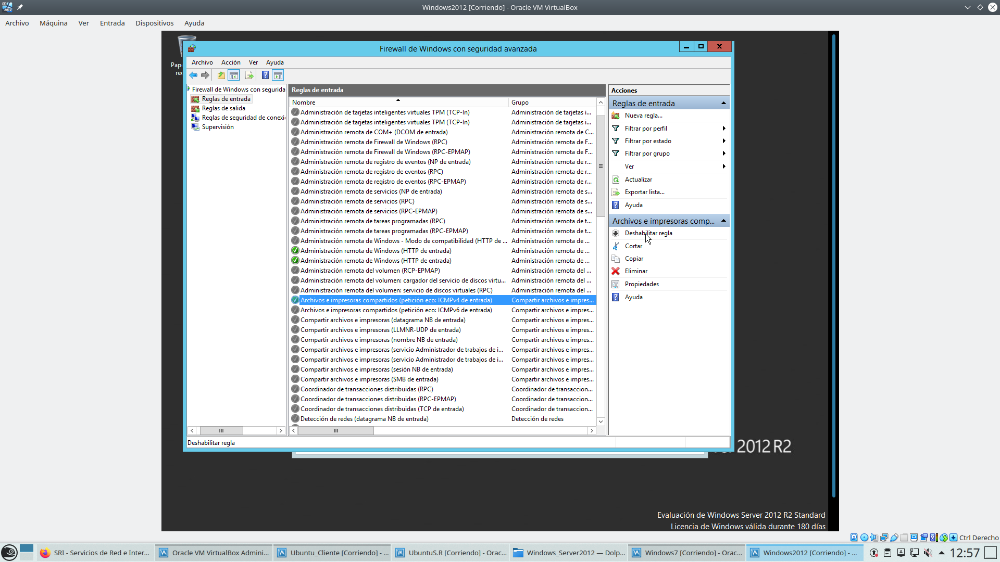

# **Windows 2012**
## Instalación 
### 1.Configuración M.V

### 2.Configuramos el internet LAN

### 3.Cambiamos el nombre y el Workgroup

### 4.Habilitamos la regla Archivos e Impresoras compartidas para así poder hacer ping entre las M.V

